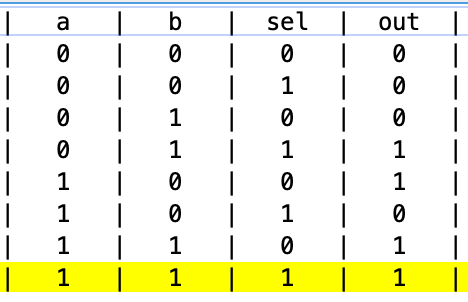
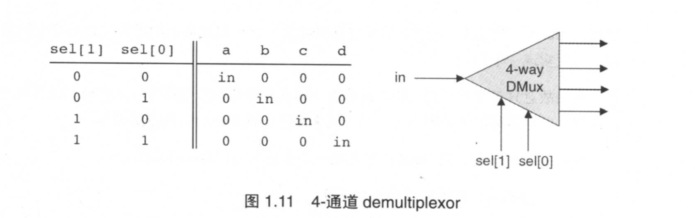

# 第一章 布尔逻辑

硬件体系:

- 芯片组
  - 寄存器
  - 内存单元
  - ALU

> ## 抽象
>
> 为什么计算机功能这么的强大,正是因为人类得天独厚的**抽象能力**.一般所谓的抽象概念.是作为表达思想的方式,将事物本质的东西从思想中独立出来.硬件软件开发者都会定义抽象(也称之为`接口` interface),从而形成了越来越高级的抽象能力.

任何程序运行之前会被编译成某个计算机平台的机器语言,这个编译过程被封为若干个抽象层,编译器,虚拟机,汇编编译器

## 编译器

分为`语法分析`和`代码生成`,

## 硬件描述语言(HDL) Hardware Description Languages

今天硬件设计者不会再用双手来设计硬件了.取而代之,使用结构化的建模型师,比如硬件描述语言.

### Nand 门

我们对计算机结构的讨论从简单的 Nand 门开始,所有其他的门电路和芯片能够通过它来构建.Nand 门用于实现一下布尔值

- Nand !& 非与门
- Not ! 非门
- And & 与门
- Or | 或门
- Xor 异或门
- Mux 选择位 if sel=0 out=a else out=b
- DMux 非选择位 if sel=0 out=b else out=a

## 1.5 项目

利用 HDL(Hardware Descript Language) + `Nand` 来实现本文上述所有的逻辑门

### Nand

|  a  |  b  | output |
| :-: | :-: | :----: |
|  0  |  0  |   1    |
|  1  |  0  |   1    |
|  0  |  1  |   1    |
|  1  |  1  |   0    |

### And

`Not(Nand(a,b))`

`Nand(Nand(a,b),Nand(a,b)) => and(a,b)`

```hdl
CHIP And {
    IN a, b;
    OUT out;

    PARTS:
    // Put your code here:
    Nand(a=a, b=b, out=nandaOrb);
    Nand(a=nandaOrb,b=nandaOrb, out=out);
}
```

### Not

`Nand(a,a) => !a`

### Or

`Nand(~a,~b)`

`Nand(Not(a),Not(b)) => a|b`

| !a  | !b  | output |
| :-: | :-: | :----: |
|  1  |  1  |   0    |
|  0  |  1  |   1    |
|  1  |  0  |   1    |
|  0  |  0  |   1    |

### Xor

`Xor(a,b) = And(Nand(a,b), And(a,b))`

### Mux

其实就是`if-else`条件语句,虽然我没看懂这其中的含义...

```hdl
Mux = And(~sel,a) Or And(sel,b)
```

```bash
sel==0 out=a
sel==1 out=b
```

|  a  |  b  | sel | out |
| :-: | :-: | :-: | :-: |
|  0  |  0  |  0  |  0  |
|  0  |  0  |  1  |  0  |
|  0  |  1  |  0  |  0  |
|  0  |  1  |  1  |  1  |
|  1  |  0  |  0  |  1  |
|  1  |  0  |  1  |  0  |
|  1  |  1  |  0  |  1  |
|  1  |  1  |  1  |  1  |

```dhl
CHIP Mux {
    IN a, b, sel;
    OUT out;

    PARTS:
    Not(in=sel, out=nsel);
    And(a=a, b=nsel, out=c);
    And(a=b, b=sel, out=d);
    Or(a=c, b=d, out=out);
}
```



### DMux

多路输出器, sel==0 输出点就是 a,否则输出点就是 b

`a = And(~sel, in) b = And(sel, b)`

| in  | sel |  a  |  b  |
| :-: | :-: | :-: | :-: |
|  0  |  0  |  0  |  0  |
|  0  |  1  |  0  |  0  |
|  1  |  0  |  1  |  0  |
|  1  |  1  |  0  |  1  |

```hdl
CHIP DMux {
    IN in, sel;
    OUT a, b;

    PARTS:
    // Put your code here:
    Not(in=sel, out=nsel);
    And(a=in, b=nsel, out=a);
    And(a=in, b=sel, out=b);
}
```

## 多通道逻辑门

很多接受 2 位逻辑门能够推广到多位,(即接受任何数量的输入)

### Or8Way

只要有一个是 1,输出 1,否则 0

|    in    | out |
| :------: | :-: |
| 00000000 |  0  |
| 11111111 |  1  |
| 00010000 |  1  |
| 00000001 |  1  |
| 00100110 |  1  |

### Mux4Way16

输入: a, b, c, d, sel[2]

输出:

```js
sel==00 => a
sel==01 => b
sel==10 => c
sel==11 => d
```

```hdl
CHIP Mux4Way16 {
    IN a[16], b[16], c[16], d[16], sel[2];
    OUT out[16];

    PARTS:
    // Put your code here:
    Mux16(a=a, b=b, sel=sel[0], out=q);
    Mux16(a=c, b=d, sel=sel[0], out=r);
    Mux16(a=q, b=r, sel=sel[1], out=out);
}
```

### Mux8Way16

输入 a,b,c,d,e,f sel[3]

输出:

```js
sel==000 => a
sel==001 => b
sel==010 => c
sel==011 => d
sel==100 => e
sel==101 => f
sel==110 => g
sel==111 => h
```

输出结果由 3 位数决定的.

### DMux4Way



### DMux8Way

和 Mux8Way 实现思路差不多

## Reference

[计算机系统要素的笔记](https://www.jianshu.com/p/a929e23192fc)
