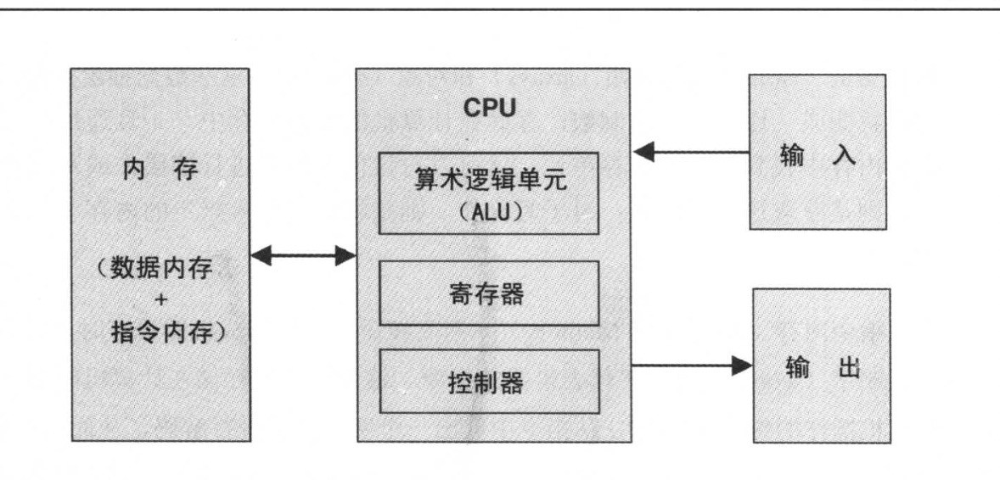

# 第 5 章 计算机体系结构

本章节是最难啃的"硬件"部分,我们将在 1-3 章所有芯片整合起来,合成一整台计算机,使得他可以成为能运行机器语言编写的程序.

## 背景知识

### 冯诺依曼结构

- 内存 (数据内存+指令内存)
- CPU (算数逻辑单元 ALU + 寄存器 + 控制器)
- 输入输出

### 内存

内存中有两种类型信息:**数据项** 和 **程序指令**,对这两种信息通常采用不同的处理方式,他们也被存在不同的内存区域,具有不同功能,但是这两种信息都是以二进制数据形式存储在数据结构的随机存储区域中(一种连续固定宽度的单元阵列,word 字节)每个单元都有独立的地址,

**数据内存** 高级程序操纵抽象单元,例如变量(variables),数组 array,对象 object,这些数据抽象被翻译成机器语言后,变成一连串的二进制数字,储存在计算机的数据内存中,一旦通过指定的地址,在数据内存中查询到对应内存,就可以对该 内存单元进行读写操作

**指令内存** 当高级命令被 翻译成机器语言时候,他变成一系列的二进制字,这些字代表机器指令,这些指令被存储在计算机的指令内存中,在计算机每一步,CPU 从指令中去除一个字.对其进行解码,从而执行指定的指令,然后计算下一条即将执行的指令,

### 5.1.4 中央处理器 CPU (check)

CPU 是计算机结构的核心,负责执行已被加载到 **指令内存** 中的指令,这些指令高速 CPU 去执行不同的计算,对内存进行读写,以及**根据条件跳转**去执行程序中其他指令,CPU 中的三个主要硬件要素执行这些任务

- **算数逻辑单元 ALU Arithmetic-Logic Unit**

  ALU 负责执行计算机中所有底层的算术操作和逻辑操作,比如典型的 ALU 可以执行的操作包括:

  - 将两个数字相加
  - 测试一个数字是否为正
  - 在一个数据字(word)中进行位操作，等等

- **寄存器 Register**

  CPU 的设计是为了快速执行简单计算。

  为了**提高性能**，我们就得将计算结果保存在本地，而不是运送到内存中。

  因此,每一个 CPU 都配有一组**高速寄存器**,每个寄存器都能够保存一个单独的字.

- **控制单元 control unit**

  计算机指令用二进制代码来表示,通常具有 16,32,64 位宽。
  
  在指令能被执行之前，我们先得对指令数据进行解码，然后指令中包含的用来通知各种硬件设备（ALU，寄存器，内存）如何执行指令的信息都必须传达到位。
  
  指令的解码过程是通过某些**控制单元**来完成的。
  
  这些控制单元还负责决定下一步需要取出和执行哪一条指令。

CPU 操作现在可被描述成一个重复的循环: 

**从内存中取出一条指令(字)、将其解码并执行该指令、取下一条指令,如此周而复始。**

指令的执行过程中可能包含下面一些微任务：

让 ALU 计算一些值、操控内部寄存器、从存储设备中读取一个字、向存储设备写入一个字。

在执行这些任务过程中，CPU也会找出下一步应该读取并执行哪一条指令。

### 5.1.5寄存器 Registers（check）

内存访问是一个很慢的过程。当 CPU 被指示去内存中地址 j 的内容的时候会经历如下过程：

1. j 从 CPU 传到 RAM;
2. RAM 的直接访问逻辑(direct-access logic)选中地址为 j 的寄存器;
3. RAM[j]的内容传回给 CPU

寄存器也能提供同样的数据读取、存储服务，并没有来回的数据传递和寻址开销。

首先,寄存器位于 CPU 芯片内部,所以对他们的访问几乎可以瞬间完成。

其次,与数百万个内存单元相比,寄存器数量非常少。

因此,机器语言指令可以在短短几个位就能指定要操作的寄存器在什么位置，从而可以简化指令格式。

基于不同的目的,不同的 CPU 采用不同的数量,不同类型的寄存器。在一些计算机体系结构中,每个寄存器可以有不同用途.

- **数据寄存器(Data registers)** 这些寄存器为 CPU 提供短期记忆(memory)服务.比如当计算(a-b)\*c 时候,必须首先计算(a-b)的值并记住它,虽然这个结果可以暂时地被存储到内存中,但更好的办法是在 CPU 内部即数据寄存器中.

- **寻址寄存器(Addressing registers)** 为了进行数据读写，CPU 必须持续访问内存。

  每次访问操作，我们都必须通过提供地址的方式，指明哪个存储字应该被访问。

  在某些情况下,这个地址作为当前指令的一个部分给出，而其他某些情况下它依赖于**前面一条指令的执行结果**。对于后者,这个地址应该被存储到某个寄存求中,使得该寄存器的内容在今后的操作中能够被当做储存单元的地址----这就需要用到**寻址寄存器**.

- **程序技术寄存器(Program counter registers)** 执行程序的时候，CPU必须持续跟踪将从指令存储器取出的下一条指令的地址。
  
  这个地址保存在一个特殊的寄存器即**程序计数器**(PC Program Counter)。PC 的内容就被当做从指令内存中取指令的地址。因此当前指令过程中,CPU 通过两种方式之一来更新 PC 的内容.
  
  1. 如果当前指令不包括 goto 命令,PC 增加 1 以便于指针指向程序的下一条指令;
  2. 如果当前指令中包含需要执行的 goto n 命令,则 CPU 将 PC 置为 n.

### 5.1.6输入输出 (check)

计算机使用各种输出输入(I/O)设备与外部环境交互。这些设备包括屏幕,键盘,扫描仪,网卡.光驱。更不用说还有令人意想不到的专有组件。单片机被用来控制汽车，武器系统，医疗设备等。我们为什么在这里关心各种设备的结构呢？有2个原因。第一，每个设备都是需要特定专业工程知识的独立设备。第二，出于同样的原因，CS科学家们已经设计了各种方案使得这些设备看上去完全一样。其中最简单的技巧称为**内存映射I/O**。

**I/O 映像**的基本思想就是:创建 I/O 设备的二进制仿真,使其对于 CPU 而言,看上去就像是普通内存段。

每个 I/O 设备都在内存中分配了独立的区域,作为他们独占的内存映像。

对于**输入设备**,键盘,鼠标,内存映像连续的不断的**反映**设备的物理状态。

对于**输出设备**(屏幕,扬声器等),内存映像连续地**驱动**设备的物理状态。

当外部事件作用于输入设备时,比如键盘上按键或者鼠标移动,某些特淡定的值就被他们写入各自对应的内存映像中,同样的如果想要控制某些输出设备,比如在屏幕上面画图或者播放一首歌曲,就要将一些特定的值写入他们各自对应的内存映像中,从硬件设备的角度看,这个方案需要所有的 I/O 设备提供类似于记忆单元(memory unit, 或者内单元)的那种接口,从软件的角度来看,需要对每个 I/O 设备定义交互协议,这样的程序才能正确的访问他.

鉴于有大量可用的计算机平台和 I/O 设备,就不难明白**标准规范**在计算机体系结构中起重要作用。

内存映射I/O架构的实际意义是巨大的。

CPU 以及整个平台的设计可以完全不依赖于要与计算机进行交互的 I/O 设备,也不依赖于 I/O 设备的数量和重量。

无论合适将新的 I/O 设备与计算机连接,所要做的只是为其分配一个新的内存映像并记录它的基地址(这些配置工作是由操作系统完成的).这样一来程序可以通过操纵 I/O 内存映像中的比特数据来实现对应物理 I/O 外设的操作。


## 5.2 Hack 硬件平台规范详述

### 5.2.1详述 （CHECK）

Hack 平台是 16 位冯诺依曼包括一个 CPU,两个独立的内存模块(指令内存和数据内存)和两个内存映像 I/O 设备\*(屏幕和键盘).前面一章给了该体系的某些部分，特别是机器语言。这里给出摘要，以便参考。

Hack 计算机执行位于指令内存中的程序,指令内存只是只读设备,因此必须使用一些外部方法将程序加载进。

比如指令内存可以使用 ROM 芯片来实现,该芯片预先烧写了所需要的程序**,加载新的程序意味着要替换整个 ROM 芯片**,该芯片先烧写了所需要的程序,加载新的程序意味着要替换整个 ROM 芯片.为了模拟这个操作,Hack 平台的硬件仿真器提供了加载大文本的方法.该文件包含了 hack 机器语言编写的程序(从现在起,我们分别用 RAM 和 ROM 来指代 Hack 的数据内存和指令内存),因为指令内只需要读取,所以它是 `Read Only Memory`.

Hack 的 cpu 由第二章介绍的 ALU 和三个分别是**数据寄存器**,**地址寄存器**,**程序计数器**的寄存器组成。

D和A是通用16位寄存器。可以被例如A=D-1的运算和逻辑指令操控。D寄存器仅用于存储数据。A寄存器的内容可以根据指令的内容被解释成三种类型：1.作为数据2.作为RAM的地址3.作为ROM的地址。

Hack 机器语言有两种 16-位命令类型,其中地址指令的格式位 `0vvvvvvvvvvvvvvv`,这里 v 代表 0 或者 1,这个指令使得计算机将 **15 位常数位**加载到 A 寄存器中,计算指令的格式则位 1111accccccddddjj,根据 hack 机器语言的规范.根据 hack 机器语言规范 a-位域(a-bits)和 c-bits 指示 ALU 计算哪个函数,d-bits 表示 ALU 的输出位域何处,j-bits 指定了可选的跳转条件.

计算机体系结构以这样的方式来进行连接,PC(程序计数器)芯片的输出端被连接到 ROM 芯片的地址输入端,如此一来,ROM 芯片总是输出 ROM[PC](大小为一个word),那么每个时钟周期内整个计算机的操作可以表示为:

- **执行(Execute)**: 当前指令中不同的 bit 位域被同时传入计算机中不同的芯片.如果其是指令地址(即 MSB=0), 则 A 寄存器被置为指令内存中含的 15-位常数.如果其是计算指令(即 MSB=1),则指令中含的 a-位域,c-位域,d-位域和 j-位域被当做是控制位,导致 ALU 和寄存器会执行该指令。

- **取指令(Fetch)**: 计算机下一步应该取哪一条指令,取决于当前指令的 jump 位和 ALU 的输出.这些值共通决定了是否去执行跳转.如果要执行跳转,则 PC 被置为 A 寄存器的值,否则就将 PC 的值+1,在下一个时钟周期内,PC 指向在 ROM 的输出中出现,如此循环.

这里的**取指令-执行**的循环意味着在 hack 平台里面,设计内存单元访问的基本操作通常需要两个指令:一个**地址指令**,用于将给定的地址赋予 A 寄存器;以及一个后续的**计算指令**.用于对与改地址对应的内存单元进行操作(可以是对 RAM 单元的读写操作,或者是 ROM 的跳转操作)

现在开始详细介绍 Hack 硬件平台.开始之前还要指出,该平台可以由前面构建的一些部分来实现.CPU 是基于第二章构建的 ALU 的.**寄存器**和**程序计数器**就是 16-位寄存器和 16-位计数器.同样,ROM 和 RAM 芯片.同样 ROM 和 RAM 芯片也是第三章中构建的内存单元版本.最后,屏幕通过内存印象与硬件平台进行接口,通过所有相同吃的接口的内置芯片 .

### 5.2.2中央处理器（CHECK）

Hack 平台的 CPU 被设计用来执行 16 位指令,它与两个互相独立的内存模块相互相连:一个是指令内存,CPU 从该内存取指令;另一个是数据内存,CPU 可以对其进行读写数据值.

### 5.2.3指令内存（CHECK）

Hack 指令内存可以济宁直接访问的只读内存设备,也称为 ROM,Hack 的只读内存 ROM 可以由 32k 的可寻址的 16-位寄存器组成

### 5.2.4数据内存（CHECK）

hack 的**数据内存**的芯片具有典型的 RAM 设备的接口,为了读取地址位 n 的内存单元中所存储的内容.就先将 n 放入内存的地址输入端口,然后从内存的输出得到结果,这是一个与时序无关的组合操作。为了将值 v 写入寄存器n,则先将 v 置于内存的数据输入端口,然后将地址 n 置于地址输入端口,并且将内存的 lod 比特位置为 1,这是一个时序操作,因此寄存器n将在下个时钟周期提交新值v。

除了能作为计算机的通用数据存储置。数据内存还可以通过内存映像在 CPU 和计算机输入/输出设备之间充当接口.

**内存映像**为了使与用户之间的交互变得简单,hack 平台与两个外部设备相连:**屏幕**和**键盘**,这连个设备都通过内存映像与计算机平台进行接口.通过对屏幕内存映像区段中的内幕才能单元进行读写.分别实现得到的屏幕状态和屏幕绘图操作.同样,可以通过检查键盘内存映像中的内存单元来得知当前按下了哪个键盘.内存映射任何时候改变屏幕内存映像中的比特位.相对应的像素就被画在物理显示器上.任何时候在物理键盘上按下一个键,这个键值对应的编码将被存储到键盘内存映像对应的内存单元。


**屏幕**

Hack计算机可以与黑白屏幕互动，该黑白屏幕组织为256行，每行512像素。 计算机通过内存映射与物理屏幕连接，该内存映射由称为“屏幕”的芯片实现。 该芯片的行为类似于常规内存，这意味着可以对其进行读写。 此外，它还具有副作用，即写入它的任何位都将反映为物理屏幕上的像素（1 =黑色，0 =白色）。 内存映射和物理屏幕坐标之间的精确映射如图5.4所示。


**Keyboard**

Hack计算机可以与标准键盘进行交互，例如个人计算机。 计算机通过称为键盘的芯片与物理键盘连接（图5.5）。 只要在物理键盘上按下一个键，它的16位ASCII码就会作为键盘芯片的输出出现。 当没有按键被按下时，芯片将输出0。除通常的ASCII码外，Keyboard芯片还可以识别并响应图5.6中列出的按键。


### **5.2.5 计算机**

Hack硬件层次结构中最顶层的芯片是一个完整的计算机系统，旨在执行用Hack机器语言编写的程序。 图5.8描述了这种抽象。 计算机芯片包含操作计算机所需的所有硬件设备，包括CPU，数据存储器，指令存储器（ROM），屏幕和键盘，它们全部实现为内部部件。 为了执行程序，必须将程序代码预加载到ROM中。 屏幕和键盘的控制是通过它们的内存映射来实现的，如屏幕和键盘芯片规格中所述。


### 5.3实现

本节提供了有关如何构建Hack计算机平台以提供其规范（第5.2节）中描述的各种服务的一般准则。 与往常一样，我们不会给出确切的构建说明，希望读者提出自己的设计。 所有芯片都可以内置在HDL中，并使用本书随附的硬件模拟器在个人计算机上进行仿真。 像往常一样，本章最后的“项目”部分提供了技术细节。


】


---

### von Neumann

冯诺依曼结构图, 下面这张图片就算冯诺依曼大神结合本期作业所给出的结构图.



首先要解决的是 `CPU.hdl` 要如何实现,参考上面的图片,我们可以看到`CPU`的输入点是内存

输出点依旧是内存,输入的是内存条中的指令,包括两种

### 数据内存 - 详细

例如 variable,array,object 等等都是存储在这个区域.以二进制形式进行存储,一旦通过指定的地址,在数据内存中找到对应的内存单元.就可以对内存进行读写操作

### 指令内存 - 详细

当高级语言被翻译成机器语言时候,他变成一系列的二进制的字,这些字(word)代表机器语言中的指令,从而计算下一条要执行的指令.这些地址指令的格式通常如下,他们常常被加载到 A 寄存器中,下面是一个典型的指令内存格式,C 指令内存,当`instruction[15]==0`的时候,是 C-指令,否则是 A-指令

```js
// 1111 a ccccc ddd jjj
//
// i  _  _  a  c1 c2 c3 c4 c5 c6 d1 d2 d3 j1 j2 j3
// 15 14 13 12 11 10 09 08 07 06 05 04 03 02 01 00

========================== A instruction ==========================
// @3001
// [0]000 1011 1011 1001
//
// Op  instruction
// Op code 0 means an instruction
Not(in=instruction[15], out=notOp);
Mux16(a=aluOut, b=instruction, sel=notOp, out=entryMuxOut);

Or(a=notOp, b=instruction[5], out=intoA);
ARegister(in=entryMuxOut, load=intoA, out=A, out[0..14]=addressM)
========================== A instruction ==========================

========================== C instruction ==========================
// Op  code is 1, indexes
// 0 - Op code
// 1-3 ???
// 4-9 ALU control bits
// 10-12 Destination load bits
// 13-15 Jump bits
//
// ALU takes input from DRegister and from ARegister or inM
And(a=instruction[15], b=instruction[12], out=AMSwitch);
Mux16(a=A, b=inM, sel=AMSwitch, out=AM);

And(a=instruction[15], b=instruction[4], out=intoD);
DRegister(in=aluOut, load=intoD, out=D);
========================== C instruction ==========================


```

a-bits 和 c-bits 通常被指定要 ALU 去计算哪个函数
d-位域通常表示 ALU 输出存于何处
j-位域指定了可选的跳转条件

而我们则根据 `instruction[15]`来判断它是数据内存还是指令内存.也就是`A-instruction`还是`C-instruction`,从而再次进行判断我们是需要加载数据还是指令

然后 ALU 计算单元的输入是其实就是上面这个指令的`11-6`位

```js
ALU(
  x=?,
  y=?,
  zx=instruction[11],   // alu control bit
  nx=instruction[10],   // alu control bit
  zy=instruction[9],    // alu control bit
  ny=instruction[8],    // alu control bit
  f=instruction[7],     // alu control bit
  no=instruction[6],    // alu control bit
  out=alu,              // 输出alu啦
  zr=zr,                // 输出zr啦啦
  ng=ng                 // 输出ng啦啦
);
```

### DRegister - data register - 数据寄存器

比如在做`(a-b)c`的时候,我们需要先暂存`a-b`的值,这个值就是被暂存到数据内存中,然后用来和 c 相乘

### ARegister - address Register - 寻址寄存器

读写的时候 CPU 需要连续访问内存中的数据,我们必须要先确定被访问的内存的字所在的内存地址,这个地址有时候是当前指令给出,但有时候这个地址依赖于前面一个指令执行的结果,比如`arr[1+2]`,相当于`arr[3]`,因为去内存中去拿这个地址开销很大,所以在寄存器中先暂存`1+2`的输出结果的值.再去拿`arr[3]`地址的值,差不多这个意思吧,虽然很可能底层不是这么实现的.

### PC - Program counter register - 程序计数器内存

执行计算的时候,CPU 必须直到下一条要执行的指令的内存地址,这个地址保存在一个特殊的地方,我们称之为 PC,早在冯诺依曼结构体系中,就提到过,计算机的本质就是: 按照顺序执行内存中的指令的一个程序, 我们将程序和数据同等的看做二进制字节 存在内存中.而 CPU 负责计算.不断顺序执行所接受到的指令,当然 遇到 GOTO 指令的时候,同时需要判断是否需要跳转咯.
